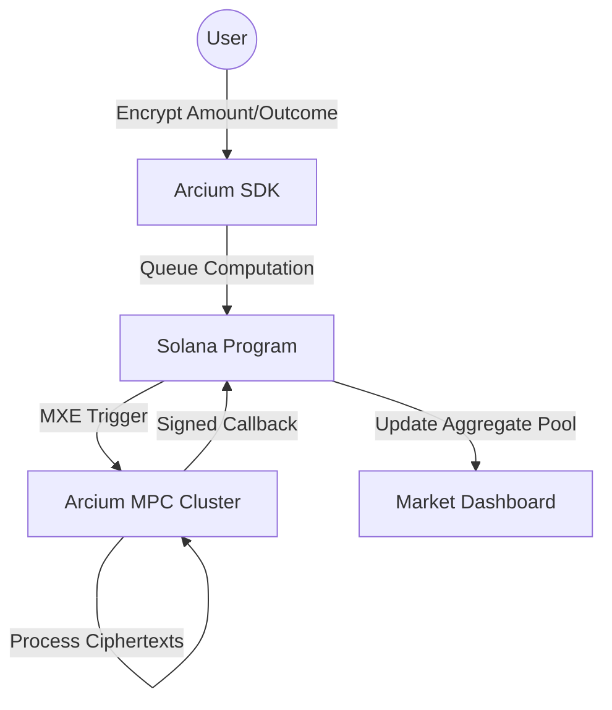

# 🌌 Arcium Obscura Markets
> **Privacy-preserving Prediction & Opinion Markets for the Arcium RTG Developer challenge.**

[](https://explorer.solana.com/address/4Bong499epakUpBjRxnfjouWnmXg718yu2KpJeRQv9yZ?cluster=devnet)
[](https://arcium.com)

Arcium Obscura Markets is a decentralized platform where stakes, votes, and resolution inputs remain encrypted. By leveraging Arcium's Multi-Party Computation (MPC) cluster, we eliminate **herding bias** and **conformity pressure**, allowing for truly honest price discovery on Solana.

---

## 🏛️ The Vision: Solving the "Public Signal" Problem
In traditional prediction markets, every bet is public. This creates a feedback loop where participants copy "whales" rather than voting on their own information. **Arcium Obscura** breaks this loop:

- **Invisible Intent:** Your choice stays encrypted in the MPC cluster.
- **Unbiased Odds:** Market-level odds are derived from aggregate pools without revealing individual behavior.
- **Private Resolution:** Opinion markets use encrypted collective voting to reach consensus without bandwagon effects.

---

## 🛠️ Tech Stack

| Layer | Technology | Role |
| :--- | :--- | :--- |
| **Blockchain** | Solana (Devnet) | Final settlement and state transparency |
| **Privacy** | Arcium MPC | Encrypted computation and pool aggregation |
| **Contract** | Anchor 0.32.1 | Program logic and Arcium callbacks |
| **Frontend** | Next.js 14 + Tailwind | Premium Dark-mode UX/UI |
| **SDK** | `@arcium-hq/client` | Client-side X25519 encryption |

---

## 📐 Architecture


### 🔒 Security Model: Commit-Reveal-MPC
1. **Client-Side Encryption:** Bets are encrypted in the browser with `Rescue` ciphers. No plaintext ever touches an RPC or Validator.
2. **Encrypted State:** The `Market` account stores an `encrypted_state` array that only the Arcium cluster can decrypt.
3. **Trustless Settlement:** Payout ratios are calculated inside the MPC cluster. The Solana program only accepts results signed by the cluster nodes.
4. **Local Receipt Model:** Your "Salt" stays in your browser, ensuring that even if a cluster is compromised post-resolution, your historical intent remains secret.

---

## 🚀 Deployment Info
- **Program ID:** `4Bong499epakUpBjRxnfjouWnmXg718yu2KpJeRQv9yZ`
- **Track:** Developer OFFCHAIN
- **Category:** Privacy-Preserving Computation
- **Live Demo:** [arcium-obscura-markets.vercel.app](https://arcium-obscura-markets.vercel.app)

---

## 🛠️ Local Development

### 1. Prerequisites
```bash
# Install Arcium Tooling
curl --proto '=https' --tlsv1.2 -sSfL https://install.arcium.com/ | bash
avm install 0.32.1 && avm use 0.32.1
```

### 2. Build & Test
```bash
# Build Arcium circuits and Anchor program
arcium build

# Run local Arcium tests
arcium test
```

### 3. Frontend
```bash
cd frontend
npm install
npm run dev
```

---

## 🎬 Proof of Work
- **Live Submission:** [arcium-obscura-markets.vercel.app](https://arcium-obscura-markets.vercel.app)
- **Devnet Explorer:** [View Program](https://explorer.solana.com/address/4Bong499epakUpBjRxnfjouWnmXg718yu2KpJeRQv9yZ?cluster=devnet)

> [!IMPORTANT]
> This project was built for the Arcium RTG Developer Challenge. It demonstrates the power of Multi-Party Computation in restoring fairness and privacy to on-chain financial primitives.
